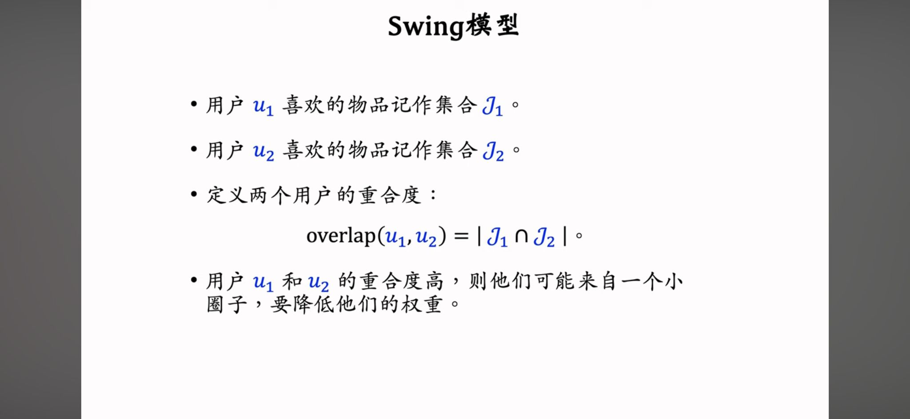
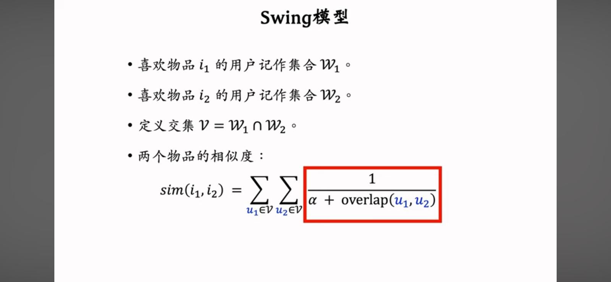
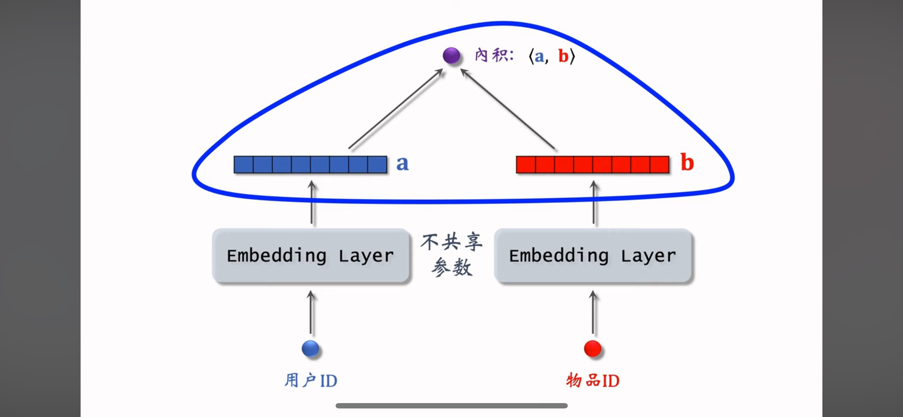
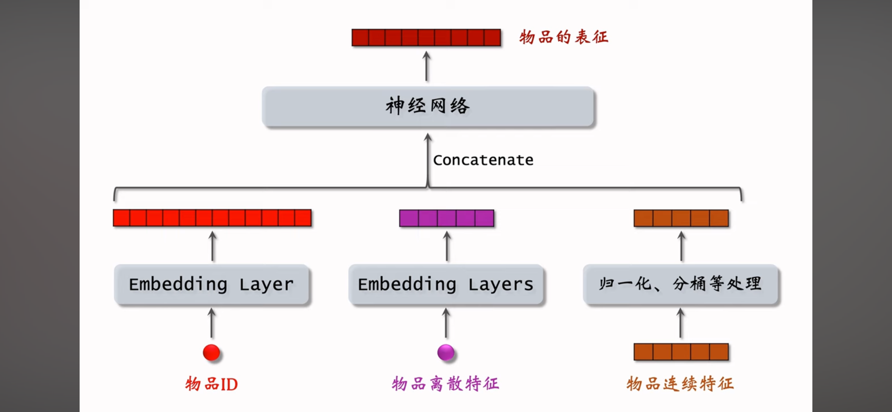
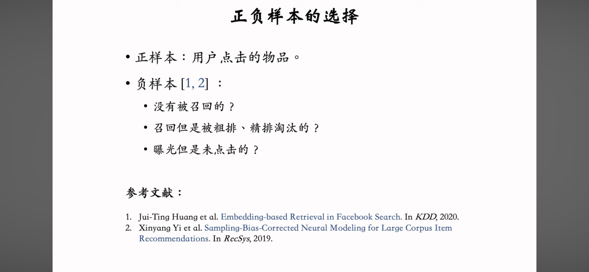
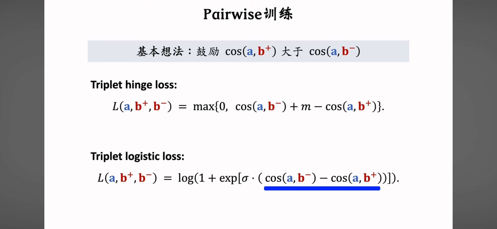
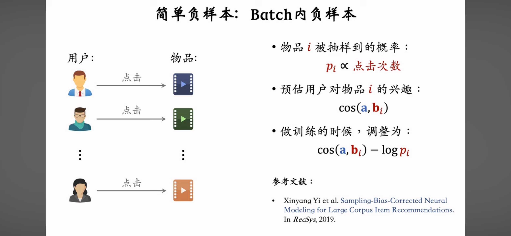
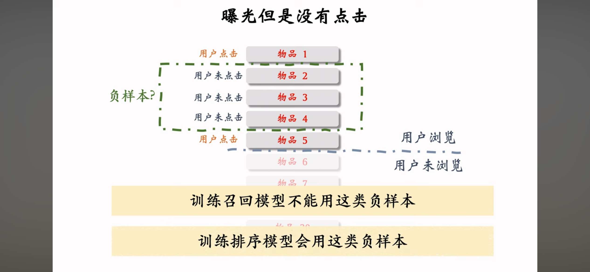

[Back to Log Page](./README.md) | [Back to Main Page](../../README.md)

# 5/7/2024: Red Content Recommendation System Tutorial (Updated on 17/7/2024)

This is a summary of the [Red Content Recommendation System Tutorial](https://youtu.be/5dTOPen28ts?si=qhYBTACSpeeFZXqk). It showcases an industrial approach to content recommendation.

## Table of Contents
- [5/7/2024: Red Content Recommendation System Tutorial (Updated on 17/7/2024)](#572024-red-content-recommendation-system-tutorial-updated-on-1772024)
  - [Table of Contents](#table-of-contents)
  - [Steps for Content Recommendation (CR) System](#steps-for-content-recommendation-cr-system)
  - [Retrieval](#retrieval)
    - [Collaborative Filtering (CF)](#collaborative-filtering-cf)
      - [Item CF](#item-cf)
      - [User CF](#user-cf)
    - [Discrete Features](#discrete-features)
      - [What is Embedding?](#what-is-embedding)
    - [Matrix Completion \& Approximate Nearest Neighbor (ANN) Search](#matrix-completion--approximate-nearest-neighbor-ann-search)
      - [Steps for Matrix Completion:](#steps-for-matrix-completion)
      - [Limitations:](#limitations)
      - [How to use the model:](#how-to-use-the-model)
      - [Approximate Nearest Neighbor (ANN) Search](#approximate-nearest-neighbor-ann-search)
    - [Deep Structured Semantic Model (DSSM)](#deep-structured-semantic-model-dssm)
      - [How to handle user/item features:](#how-to-handle-useritem-features)
      - [Training DSSM:](#training-dssm)
      - [How to select the sample items:](#how-to-select-the-sample-items)
      - [Pointwise](#pointwise)
      - [Pairwise](#pairwise)
      - [Listwise](#listwise)
      - [Non-Retrieval DSSM](#non-retrieval-dssm)
    - [Positive \& Negative Sample](#positive--negative-sample)
      - [Positive Sample](#positive-sample)
      - [Negative Sample](#negative-sample)
      - [1. All Items](#1-all-items)
      - [2. Batch Negative Items](#2-batch-negative-items)
      - [Training Negative Sample](#training-negative-sample)

## Steps for Content Recommendation (CR) System
1. **Retrieval** (reduces results from trillions to thousands)
   - Typically combines different methods (e.g., Collaborative Filtering, GNN) to retrieve results and aggregate them.

2. **Pre-Ranking** (reduces results from thousands to hundreds)
   - Neural networks are used here to predict evaluation metrics (e.g., click-through rate, like rate).

3. **Ranking** (a more complex mechanism for ranking results compared to pre-ranking)

4. **Re-Ranking** (reduces results from hundreds to tens)
   - Considers both scores and variety of the results, setting rules to redistribute similar results.
   - Uses different sampling methods (e.g., MMR, DPP) to reduce results.
   - Adds advertisements and additional information to the results.

## Retrieval
### Collaborative Filtering (CF)
- This technique relies heavily on user behavior data to make recommendations, which can be difficult to collect.

#### Item CF

If a user is interested in an item, they are more likely to be interested in similar items.

Item CF requires two indexes to store user and item data. These indexes are created and updated offline.

- **User-Item Index:**
  Stores user behavior data (e.g., the past 100 clicks and other interactions) to determine user preferences (i.e., $like(user, item_j)$).

- **Item-Item Index:**
  
  Stores content data to determine item similarity. When user groups are similar, the item groups are also considered similar. The Jaccard index or cosine similarity is usually used to determine if two items are similar.

- **Retrieval Procedure:**
  
  1. Given a `user_id`, return the `last-n` items the user has interacted with through the `User-Item Index` (assuming interest in these items).
  2. Using the `last-n` items, return the `top-k` similar items for each item through the `Item-Item Index`.
  3. This method returns at most $n \times k$ similar results. It then predicts the interest score for each item.
  4. Return the top 100 results.

- **Misclassification of Similar Items:**
  
  Two items may be considered similar if they are interacted with by a small group of users. It's possible that this small group consists of friends or people who share the same information sources through social media or communities. This can lead to the misclassification of irrelevant items as similar.

  
  The **Swing Model** is used to identify users from the same group and lower their weightings when calculating the similarity of two items.

#### User CF

If users are in the same group, they are more likely to be interested in similar items.

Similar to Item CF, User CF requires two indexes to store user and item data. These indexes are created and updated offline.

- **User-Item Index:**
  Stores user behavior data (e.g., the past 100 clicks and other interactions) to determine user preferences (i.e., $like(user, item_j)$).

- **User-User Index:**
  
  Stores user similarity data, which can then be used to determine if two users are similar.

- **Retrieval Procedure:**
  
  1. Given a *user_id*, return the `top-k` similar users through the `User-User Index`.
  2. Using the `top-k` users, return the `last-n` items that each user has interacted with through the `User-Item Index`.
  3. This method returns at most $n \times k$ similar results. It then predicts the interest score for each item.
  4. Return the top 100 results.

- **Misclassification of Similar Users:**
  Two users may be considered similar if they both interacted with popular items (e.g., classic movies, books, music).

  
  To reduce the effect of popular items on user similarity, we need to lower their weighting.

### Discrete Features
This section discusses how to handle different discrete features (e.g., country, item_id, etc.). Discrete features are discontinuous and have definite feature boundaries (i.e., fixed values).

1. **Dictionary:** One simple approach is to build a dictionary to map the features (e.g., China -> 1, US -> 2, India -> 3).
2. **One-hot Encoding:** Project features into high-dimensional vectors (e.g., gender: from male/female to 0/1). It creates columns for each feature value. However, when used with features that have many values, it will create a high-dimensional vector (e.g., word, id, etc.).
3. **Embedding:** Project features into low-dimensional vectors. It is trained on a large-scale dataset using a deep learning model.

#### What is Embedding?

We can use machine learning algorithms to find the parameter matrix that best fits the data (different feature values). Then, we can use the parameter matrix to map the feature values (one-hot encoding) to the embedding vectors. The use case will be explained in the next section, [Matrix Completion](#matrix-completion--approximate-nearest-neighbor-ann-search), although it is not used in the industrial approach.

### Matrix Completion & Approximate Nearest Neighbor (ANN) Search
Matrix completion is a technique used to fill in missing values in a matrix. For example, users may only interact with a small number of items (~3% of total items). Matrix completion can be used to fill in the missing values in the matrix. However, this approach is not used in the industry due to several limitations. We can consider this method as the foundation of another powerful method, [Deep Structured Semantic Model (DSSM)](#deep-structured-semantic-model-dssm).

#### Steps for Matrix Completion:

We train the embedding layers for user_id and item_id respectively. Then, we can get the inner product of the two vectors.

We solve the minimization problem to get the optimized vectors A and B.

The final matrix can show user interest in different items.

#### Limitations:

- The model doesn’t consider other important features (e.g., item property, user attributes, etc.).
- The model doesn’t have a good negative samples mechanism. It counts towards no interaction, which is an indirect source of information.

- The model uses inner product while cosine similarity is the widely-used calculation method. Also, it uses Mean Square Error (MSE) instead of Cross Entropy as the loss function in the minimization problem. Cross Entropy is a better function for discrete or categorical features, while Mean Square Error is more suitable for continuous features.

#### How to use the model:

We store the optimized vectors A and B in the index table. Then, we can use the user_id as the key to retrieve the optimized vectors. Finally, we can get the inner product of the two vectors to get the interest score of the user in the item.
   - However, if we calculate the interest score of all users in the item, it will be too slow. We should use the **Approximate Nearest Neighbor (ANN) Search** to accelerate the calculation.

#### Approximate Nearest Neighbor (ANN) Search
Systems that support ANN: Milvus, Faiss, HnswLib, etc.

Methods to find the nearest neighbors:
- Euclidean Distance (L2 norm)
- Inner Product
- Cosine Similarity

Depending on the method we choose, we will have different shapes of areas for the vector results (e.g., Cosine Similarity -> Sector) when we pre-process the data. We can calculate the inner product of the two vectors to get the interest score of the user in the item. We can then find the nearest neighbors vector and get all the results through an index table.

### Deep Structured Semantic Model (DSSM)
#### How to handle user/item features:

1. `user_id` -> Embedding Layer -> `user_id_vector`
2. `user_discrete_feature` -> Embedding Layer (one layer for each feature; for features that have few values, we can use one-hot encoding) -> `user_df_vector`
3. `user_continuous_feature` -> Standardization (mean = 0, standard deviation = 1)/Log Transformation/Bucketing -> `user_cf_vector`
4. Concatenate `user_id_vector`, `user_df_vector`, `user_cf_vector` -> Neural Network -> `user_vector` (user characterization)

After the user vector and the item vector are generated, we can calculate the inner product of the two vectors to get the interest score of the user in the item.

#### Training DSSM:

1. **Pointwise:** Consider all positive and negative samples in the training set. Then, perform binary classification by randomly sampling in the training set (can be +ve/-ve).
2. **Pairwise:** Consider all positive and negative pairs (+ve, -ve) in the training set. Use a triplet loss function to calculate the loss and train the model. (Refer to **Facebook**, [Embedding-based Retrieval in Facebook Search](https://dl.acm.org/doi/abs/10.1145/3394486.3403305))
3. **Listwise:** Consider a positive and some negative samples list [+ve, -ve, -ve, ...] in the training set. The training method is similar to the Pairwise method. (Refer to **YouTube**, [Sampling-Bias-Corrected Neural Modeling for Large Corpus Item Recommendations](https://research.google/pubs/sampling-bias-corrected-neural-modeling-for-large-corpus-item-recommendations/))

#### How to select the sample items:

- **Positive Sample:** User-interacted item
- **Negative Sample:** Non-retrieved item, retrieved but filtered out item (by Ranking/Re-Ranking), exposed but not clicked item
For details, please check [Positive & Negative Sample](#positive--negative-sample).

#### Pointwise

$a$ and $b$ are the vectors of the user and item respectively.
- Consider retrieval as a binary classification problem.
- For +ve sample, reward $cos(a, b)$ -> 1.
- For -ve sample, reward $cos(a, b)$ -> -1.
- Control the ratio of +ve sample and -ve sample to 1:2 or 1:3 (no special reason).

#### Pairwise

Calculate the +ve and -ve samples simultaneously using the same embedding layer.

We aim to maximize the difference between the similarity of the +ve and -ve samples. **Triplet Hinge Loss** is used to calculate the loss and train the model. ($m$ is the hyperparameter)

We can also use **Triplet Logistic Loss** to calculate the loss and train the model. ($\sigma$ is the hyperparameter; if you want to understand more about the entropy loss function, you can check [here](https://youtu.be/YtebGVx-Fxw?si=2o5PsffHfAkVqnbq).)

#### Listwise

We aim to maximize the similarity of +ve samples and minimize the similarity of -ve samples. We use **Softmax Loss** to calculate the loss and train the model.

#### Non-Retrieval DSSM
First, conduct the feature embedding and then calculate the inner product of the two vectors to get the interest score of the user in the item. If the model concatenates the user vector and the item vector first and passes it through the neural network, it is a **Ranking** model instead.

### Positive & Negative Sample
The purpose of the Retrieval Stage is to classify items into those that the user may be interested in and those that they are not interested in, without the need to rank them. Improving the selection of positive and negative samples is crucial for the effectiveness of this stage.

#### Positive Sample

**Problem: Pareto Principle** (20% of items can cover 80% of needs)

Including too many popular items in the positive sample can lead to a self-reinforcing cycle. Popular items will become even more prominent, suppressing other items and harming the system's ability to surface diverse or lesser-known content.

**Solution**:
- **Up-sampling**: Duplicate less-popular items.
- **Down-sampling**: Discard some popular items, with the probability of discarding an item being positively correlated with its popularity.

#### Negative Sample

**Easy Sample** (Items that are not Retrieved)

#### 1. All Items

Since only thousands of items are retrieved from millions, we can assume users are not interested in the vast majority of items. We can perform negative sampling across all items.

**Problem**: Sampling all items equally weighted is unfair because most items are unpopular. This imbalance causes most positive items to be popular and negative items to be unpopular, leading to the same self-reinforcing cycle.

**Solution**: Weight the selection probability of an item based on its popularity.
$$
p \propto (\text{click-rate})^{0.75}
$$

#### 2. Batch Negative Items

We can also consider negative samples in different batches. For example, if a user clicks `item_A`, we can create a batch from `item_B` to `item_N`. For $N$ items and $N$ users, this results in $n(n-1)$ negative items.

**Problem**: 
$$
p \not\propto (\text{click-rate}^{0.75})
$$
Instead,
$$
p \propto \text{click-rate}
$$
The probability of selecting a popular item as a negative sample is too high, affecting model performance.

**Solution**: According to a [previous paper]((https://research.google/pubs/sampling-bias-corrected-neural-modeling-for-large-corpus-item-recommendations/)) by **YouTube**, we can add $-\log p$ to the formula of user interest.

**Hard Sample** (Items that are retrieved but discarded by the **Pre-Rank Stage**/**Ranking Stage**)

The Retrieval Stage aims to classify items the user may be interested in or not. However, it is challenging to classify items discarded in the **Pre-Rank Stage**, and even harder for those lower ranked in the **Ranking Stage**. Therefore, hard samples should also be considered in the negative sample.

**Exposed but Not-Clicked Items**

While it makes sense to include exposed but not-clicked items as negative samples, it can harm the model's effectiveness. Remember, the purpose of the **Retrieval Stage** is not to rank items; this method is used in the **Ranking Stage**.

#### Training Negative Sample

Different negative samples should be included in training. A common approach is to use 50% easy samples (All Items) and 50% hard samples (Items that are retrieved but discarded by the **Pre-Rank Stage**/**Ranking Stage**).
