[Back to RedRS_Tutorial Page](./RedRS_Tutorial.md) | [Back to Main Page](../../../README.md)

<h1> Retrieval Stage (Updated on 14/11/2024)</h1>

# Table of Contents
- [Table of Contents](#table-of-contents)
  - [Collaborative Filtering (CF)](#collaborative-filtering-cf)
    - [Item CF](#item-cf)
    - [User CF](#user-cf)
  - [Discrete Features](#discrete-features)
    - [What is Embedding?](#what-is-embedding)
  - [Matrix Completion \& Approximate Nearest Neighbor (ANN) Search](#matrix-completion--approximate-nearest-neighbor-ann-search)
    - [Steps for Matrix Completion:](#steps-for-matrix-completion)
    - [Limitations:](#limitations)
    - [How to use the model:](#how-to-use-the-model)
    - [Approximate Nearest Neighbor (ANN) Search](#approximate-nearest-neighbor-ann-search)
  - [Deep Structured Semantic Model (DSSM)](#deep-structured-semantic-model-dssm)
    - [Overview](#overview)
      - [How to handle user/item features:](#how-to-handle-useritem-features)
      - [Training DSSM:](#training-dssm)
      - [How to select the sample items:](#how-to-select-the-sample-items)
      - [Pointwise](#pointwise)
      - [Pairwise](#pairwise)
      - [Listwise](#listwise)
      - [Non-Retrieval DSSM](#non-retrieval-dssm)
    - [Positive \& Negative Sample](#positive--negative-sample)
      - [Positive Sample](#positive-sample)
      - [Negative Sample](#negative-sample)
      - [1. All Items](#1-all-items)
      - [2. Batch Negative Items](#2-batch-negative-items)
      - [Training Negative Sample](#training-negative-sample)
    - [Production Environment](#production-environment)
      - [Using the DSSM Model in a Production Environment:](#using-the-dssm-model-in-a-production-environment)
      - [Model Updates](#model-updates)
    - [Self-Supervised Learning](#self-supervised-learning)
      - [Listwise Training \& Cross-Entropy Loss Function](#listwise-training--cross-entropy-loss-function)
      - [Applying Self-Supervised Learning in Item Tower:](#applying-self-supervised-learning-in-item-tower)
      - [Feature Transformation](#feature-transformation)
      - [Training the Item Tower](#training-the-item-tower)
      - [Combining with the DSSM Model](#combining-with-the-dssm-model)
  - [Deep Retrieval (DR)](#deep-retrieval-dr)
    - [Indexing](#indexing)
      - [Path-to-Item Index Table](#path-to-item-index-table)
      - [Item-to-Path Index Table](#item-to-path-index-table)
    - [Predictive Model](#predictive-model)
      - [Predicting User Interest](#predicting-user-interest)
      - [Neural Network Practice](#neural-network-practice)
    - [Retrieval Procedure](#retrieval-procedure)
      - [Beam Search](#beam-search)
    - [Training](#training)
      - [Training the Neural Network](#training-the-neural-network)
      - [Training Item Features](#training-item-features)
  - [Bloom Filter](#bloom-filter)
    - [Steps](#steps)
      - [How It Works:](#how-it-works)
    - [Adjusting the Value of $k$](#adjusting-the-value-of-k)
    - [Disadvantages of Using a Bloom Filter](#disadvantages-of-using-a-bloom-filter)

## Collaborative Filtering (CF)
- This technique relies heavily on user behavior data to make recommendations, which can be difficult to collect.

### Item CF

If a user is interested in an item, they are more likely to be interested in similar items.

Item CF requires two indexes to store user and item data. These indexes are created and updated offline.

- **User-Item Index:**
  Stores user behavior data (e.g., the past 100 clicks and other interactions) to determine user preferences (i.e., `like(user, item_j)`).

- **Item-Item Index:**
  
  Stores content data to determine item similarity. When user groups are similar, the item groups are also considered similar. The Jaccard index or cosine similarity is usually used to determine if two items are similar.

- **Retrieval Procedure:**
  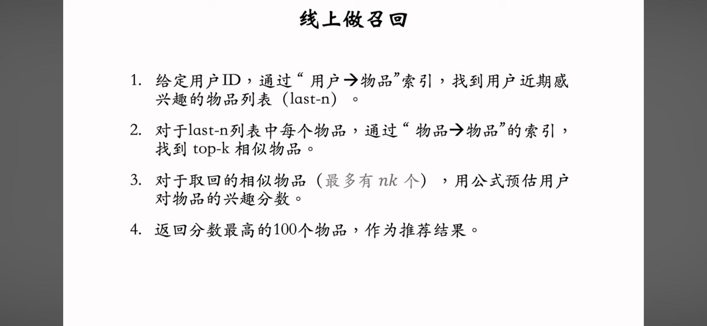
  1. Given a `user_id`, return the `last-n` items the user has interacted with through the `User-Item Index` (assuming interest in these items).
  2. Using the `last-n` items, return the `top-k` similar items for each item through the `Item-Item Index`.
  3. This method returns at most $n \times k$ similar results. It then predicts the interest score for each item.
  4. Return the top 100 results.

- **Misclassification of Similar Items:**
  
  Two items may be considered similar if they are interacted with by a small group of users. It's possible that this small group consists of friends or people who share the same information sources through social media or communities. This can lead to the misclassification of irrelevant items as similar.

  
  The **Swing Model** is used to identify users from the same group and lower their weightings when calculating the similarity of two items.

### User CF

If users are in the same group, they are more likely to be interested in similar items.

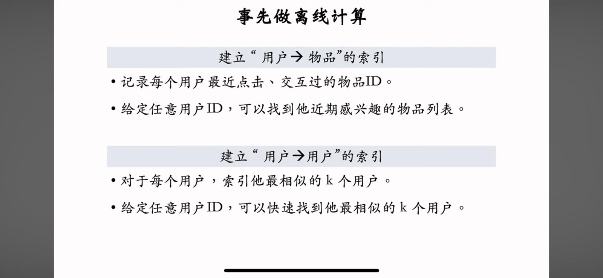
Similar to Item CF, User CF requires two indexes to store user and item data. These indexes are created and updated offline.

- **User-Item Index:**
  Stores user behavior data (e.g., the past 100 clicks and other interactions) to determine user preferences (i.e., `like(user, item_j)`).

- **User-User Index:**
  
  Stores user similarity data, which can then be used to determine if two users are similar.

- **Retrieval Procedure:**
  
  1. Given a *user_id*, return the `top-k` similar users through the `User-User Index`.
  2. Using the `top-k` users, return the `last-n` items that each user has interacted with through the `User-Item Index`.
  3. This method returns at most $n \times k$ similar results. It then predicts the interest score for each item.
  4. Return the top 100 results.

- **Misclassification of Similar Users:**
  Two users may be considered similar if they both interacted with popular items (e.g., classic movies, books, music).

  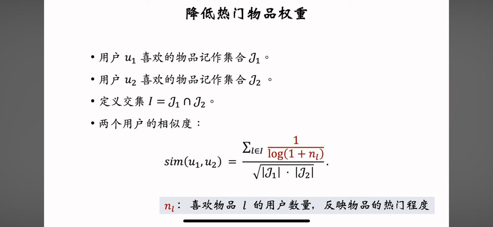
  To reduce the effect of popular items on user similarity, we need to lower their weighting.

## Discrete Features
This section discusses how to handle different discrete features (e.g., country, item_id, etc.). Discrete features are discontinuous and have definite feature boundaries (i.e., fixed values).

1. **Dictionary:** One simple approach is to build a dictionary to map the features (e.g., China -> 1, US -> 2, India -> 3).
2. **One-hot Encoding:** Project features into high-dimensional vectors (e.g., gender: from male/female to 0/1). It creates columns for each feature value. However, when used with features that have many values, it will create a high-dimensional vector (e.g., word, id, etc.).
3. **Embedding:** Project features into low-dimensional vectors. It is trained on a large-scale dataset using a deep learning model.

### What is Embedding?
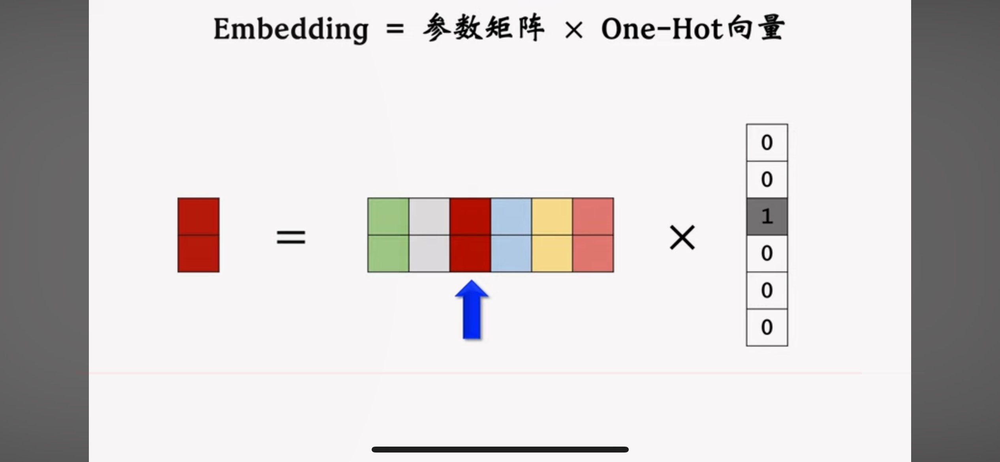
We can use machine learning algorithms to find the parameter matrix that best fits the data (different feature values). Then, we can use the parameter matrix to map the feature values (one-hot encoding) to the embedding vectors. The use case will be explained in the next section, [Matrix Completion](#matrix-completion--approximate-nearest-neighbor-ann-search), although it is not used in the industrial approach.

## Matrix Completion & Approximate Nearest Neighbor (ANN) Search
Matrix completion is a technique used to fill in missing values in a matrix. For example, users may only interact with a small number of items (~3% of total items). Matrix completion can be used to fill in the missing values in the matrix. However, this approach is not used in the industry due to several limitations. We can consider this method as the foundation of another powerful method, [Deep Structured Semantic Model (DSSM)](#deep-structured-semantic-model-dssm).

### Steps for Matrix Completion:

We train the embedding layers for user_id and item_id respectively. Then, we can get the inner product of the two vectors.

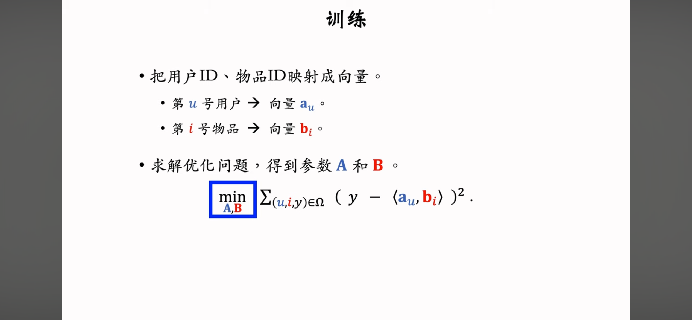
We solve the minimization problem to get the optimized vectors A and B.

The final matrix can show user interest in different items.

### Limitations:

- The model doesn’t consider other important features (e.g., item property, user attributes, etc.).
- The model doesn’t have a good negative samples mechanism. It counts towards no interaction, which is an indirect source of information.

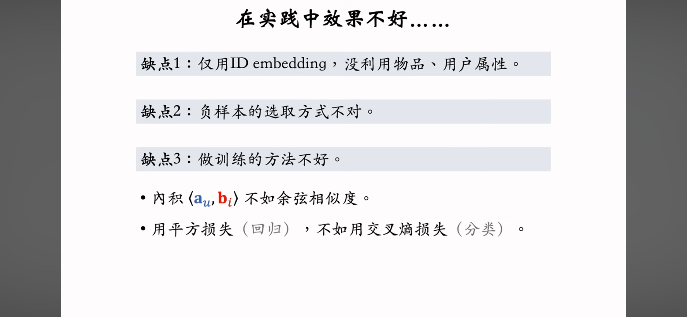
- The model uses inner product while cosine similarity is the widely-used calculation method. Also, it uses Mean Square Error (MSE) instead of Cross Entropy as the loss function in the minimization problem. Cross Entropy is a better function for discrete or categorical features, while Mean Square Error is more suitable for continuous features.

### How to use the model:

We store the optimized vectors A and B in the index table. Then, we can use the user_id as the key to retrieve the optimized vectors. Finally, we can get the inner product of the two vectors to get the interest score of the user in the item.
   - However, if we calculate the interest score of all users in the item, it will be too slow. We should use the **Approximate Nearest Neighbor (ANN) Search** to accelerate the calculation.

### Approximate Nearest Neighbor (ANN) Search
Systems that support ANN: Milvus, Faiss, HnswLib, etc.

Methods to find the nearest neighbors:
- Euclidean Distance (L2 norm)
- Inner Product
- Cosine Similarity

Depending on the method we choose, we will have different shapes of areas for the vector results (e.g., Cosine Similarity -> Sector) when we pre-process the data. We can calculate the inner product of the two vectors to get the interest score of the user in the item. We can then find the nearest neighbors vector and get all the results through an index table.

## Deep Structured Semantic Model (DSSM)
### Overview
#### How to handle user/item features:
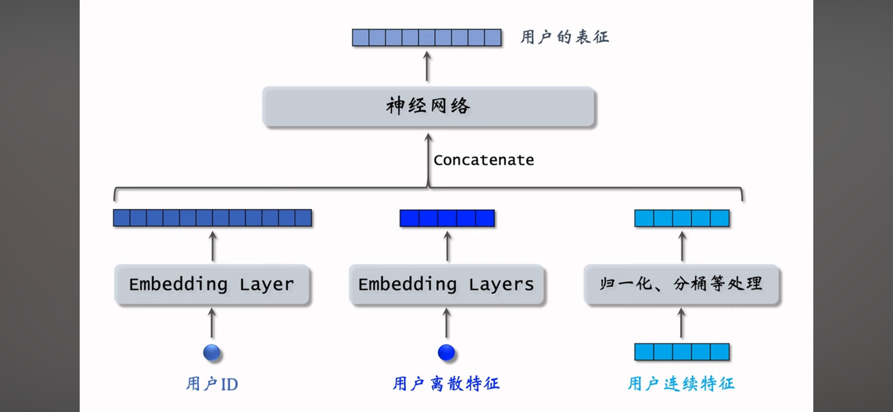

1. `user_id` -> Embedding Layer -> `user_id_vector`
2. `user_discrete_feature` -> Embedding Layer (one layer for each feature; for features that have few values, we can use one-hot encoding) -> `user_df_vector`
3. `user_continuous_feature` -> Standardization (mean = 0, standard deviation = 1)/Log Transformation/Bucketing -> `user_cf_vector`
4. Concatenate `user_id_vector`, `user_df_vector`, `user_cf_vector` -> Neural Network -> `user_vector` (user characterization)

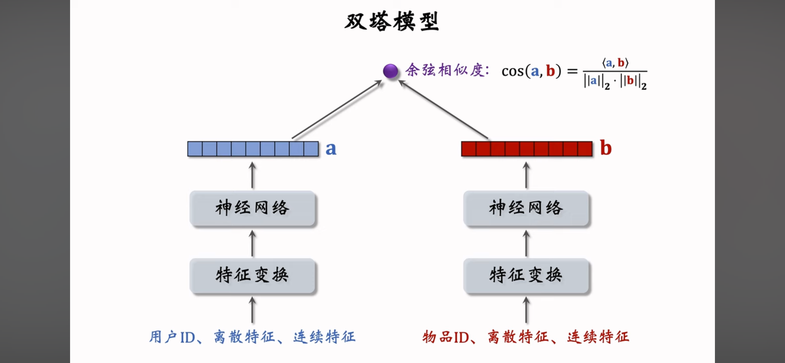
After the user vector and the item vector are generated, we can calculate the inner product of the two vectors to get the interest score of the user in the item.

#### Training DSSM:
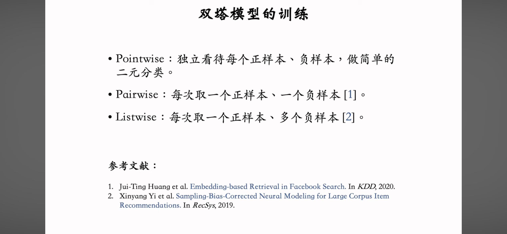
1. **Pointwise:** Consider all positive and negative samples in the training set. Then, perform binary classification by randomly sampling in the training set (can be +ve/-ve).
2. **Pairwise:** Consider all positive and negative pairs (+ve, -ve) in the training set. Use a triplet loss function to calculate the loss and train the model. (Refer to **Facebook**, [Embedding-based Retrieval in Facebook Search](https://dl.acm.org/doi/abs/10.1145/3394486.3403305))
3. **Listwise:** Consider a positive and some negative samples list [+ve, -ve, -ve, ...] in the training set. The training method is similar to the Pairwise method. (Refer to **YouTube**, [Sampling-Bias-Corrected Neural Modeling for Large Corpus Item Recommendations](https://research.google/pubs/sampling-bias-corrected-neural-modeling-for-large-corpus-item-recommendations/))

#### How to select the sample items:

- **Positive Sample:** User-interacted item
- **Negative Sample:** Non-retrieved item, retrieved but filtered out item (by Ranking/Re-Ranking), exposed but not clicked item
For details, please check [Positive & Negative Sample](#positive--negative-sample).

#### Pointwise
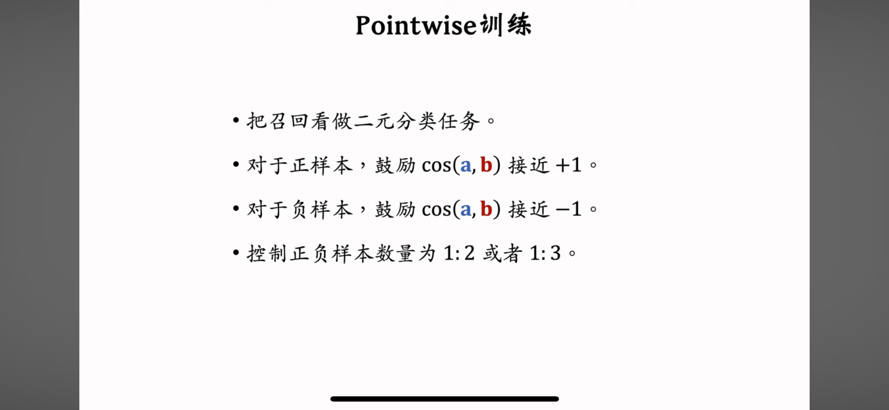
$a$ and $b$ are the vectors of the user and item respectively.
- Consider retrieval as a binary classification problem.
- For +ve sample, reward $cos(a, b)$ -> 1.
- For -ve sample, reward $cos(a, b)$ -> -1.
- Control the ratio of +ve sample and -ve sample to 1:2 or 1:3 (no special reason).

#### Pairwise
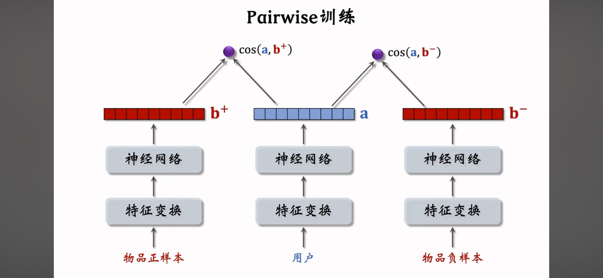
Calculate the +ve and -ve samples simultaneously using the same embedding layer.
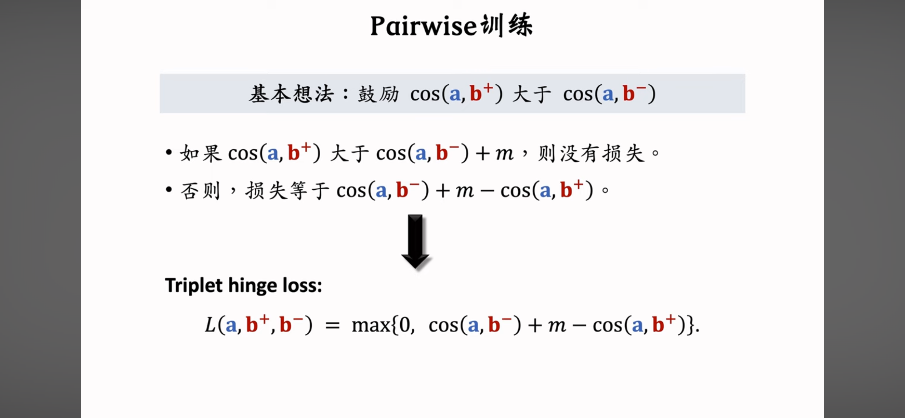
We aim to maximize the difference between the similarity of the +ve and -ve samples. **Triplet Hinge Loss** is used to calculate the loss and train the model. ($m$ is the hyperparameter)

We can also use **Triplet Logistic Loss** to calculate the loss and train the model. ($\sigma$ is the hyperparameter; if you want to understand more about the entropy loss function, you can check [here](https://youtu.be/YtebGVx-Fxw?si=2o5PsffHfAkVqnbq).)

#### Listwise
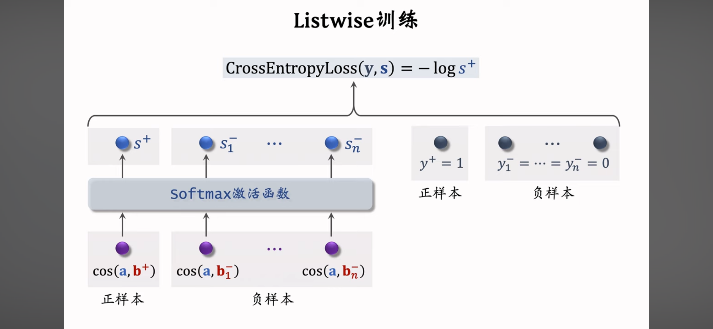
We aim to maximize the similarity of +ve samples and minimize the similarity of -ve samples. We use **Softmax Loss** to calculate the loss and train the model.

#### Non-Retrieval DSSM
First, conduct the feature embedding and then calculate the inner product of the two vectors to get the interest score of the user in the item. If the model concatenates the user vector and the item vector first and passes it through the neural network, it is a **Ranking** model instead.

### Positive & Negative Sample
The purpose of the Retrieval Stage is to classify items into those that the user may be interested in and those that they are not interested in, without the need to rank them. Improving the selection of positive and negative samples is crucial for the effectiveness of this stage.

#### Positive Sample

**Problem: Pareto Principle** (20% of items can cover 80% of needs)

Including too many popular items in the positive sample can lead to a self-reinforcing cycle. Popular items will become even more prominent, suppressing other items and harming the system's ability to surface diverse or lesser-known content.

**Solution**:
- **Up-sampling**: Duplicate less-popular items.
- **Down-sampling**: Discard some popular items, with the probability of discarding an item being positively correlated with its popularity.

#### Negative Sample

**Easy Sample** (Items that are not Retrieved)

#### 1. All Items

Since only thousands of items are retrieved from millions, we can assume users are not interested in the vast majority of items. We can perform negative sampling across all items.

**Problem**: Sampling all items equally weighted is unfair because most items are unpopular. This imbalance causes most positive items to be popular and negative items to be unpopular, leading to the same self-reinforcing cycle.

**Solution**: Weight the selection probability of an item based on its popularity.

$$
p \propto (\text{click-rate})^{0.75}
$$

#### 2. Batch Negative Items

We can also consider negative samples in different batches. For example, if a user clicks `item_A`, we can create a batch from `item_B` to `item_N`. For $N$ items and $N$ users, this results in $n(n-1)$ negative items.

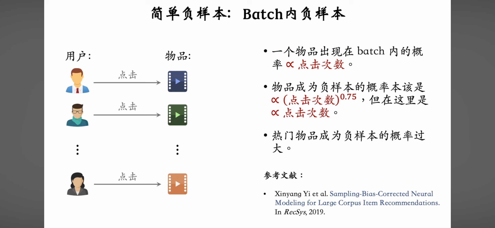

**Problem**: 

$$
p \not\propto (\text{click-rate}^{0.75})
$$

Instead,

$$
p \propto \text{click-rate}
$$

The probability of selecting a popular item as a negative sample is too high, affecting model performance.

**Solution**: According to a [previous paper]((https://research.google/pubs/sampling-bias-corrected-neural-modeling-for-large-corpus-item-recommendations/)) by **YouTube**, we can add $-\log p$ to the formula of user interest.

**Hard Sample** (Items that are retrieved but discarded by the **Pre-Rank Stage**/**Ranking Stage**)

The Retrieval Stage aims to classify items the user may be interested in or not. However, it is challenging to classify items discarded in the **Pre-Rank Stage**, and even harder for those lower ranked in the **Ranking Stage**. Therefore, hard samples should also be considered in the negative sample.

**Exposed but Not-Clicked Items**

While it makes sense to include exposed but not-clicked items as negative samples, it can harm the model's effectiveness. Remember, the purpose of the **Retrieval Stage** is not to rank items; this method is used in the **Ranking Stage**.

#### Training Negative Sample

Different negative samples should be included in training. A common approach is to use 50% easy samples (All Items) and 50% hard samples (Items that are retrieved but discarded by the **Pre-Rank Stage**/**Ranking Stage**).

### Production Environment

#### Using the DSSM Model in a Production Environment:

- **Item Index:**  
  Store the `item_id` and corresponding `item_vector` in an index table. Real-time calculation is too computationally expensive, so in production, use Approximate Nearest Neighbor (ANN) Search to return the $n$ nearest results for a given `user_vector` or `query_vector`.

  *Note: You can use vector databases such as Milvus, Faiss, or HNSWlib.*

- **User Index:**  
  Calculate the `user_vector` in real-time since it changes frequently, and the most recent interaction records are typically more significant for accurate measurement.

#### Model Updates

- **Regular Update:**  
  Perform incremental training on top of the existing model (rather than reinitializing all parameters) using the previous day's data as one epoch (daily data is used only once). After training, update the `item_vector` index and user index tables.

  **Training Time:** Midnight (Batch Update)

- **Dynamic Update:**  
  Train the model in a real-time environment to better adapt to user interests. This process involves generating TFRecord files for training, then updating only the model’s `ID Embedding` parameters (without retraining other parts of the neural network). Finally, update the new user `ID Embedding` for real-time application.

  **Limitation:** There may be latency issues when updating records.

  **Training Time:** Real-Time Update

- **Industrial Approach:**  
  Combine both **Regular Update** and **Dynamic Update**. At the end of each day, discard the results of the **Dynamic Update** and perform the **Regular Update**.

- **Why Not Use Only the Dynamic Update?**  
  While the computational cost of relying solely on **Dynamic Update** is lower, performance is generally worse compared to the hybrid approach. This is due to several factors:
    1. **Time Interval Differences (Hour/Minute):** User interests can vary significantly between different times of the day, such as morning versus night.
    2. **Data Shuffling:** **Regular Update** shuffles the daily data randomly for 1-epoch training, leading to better performance. In contrast, **Dynamic Update** trains in a sequence that follows the timeliness of the data, which may result in less effective learning.

### Self-Supervised Learning
Self-supervised learning aims to enhance the training performance of the item tower, especially for less popular items, by addressing the [Pareto Principle](#positive-sample) problem through data augmentation. This principle often results in poor performance for unpopular items. For more details, refer to **Google**'s paper: [Self-supervised Learning for Large-scale Item Recommendations](https://dl.acm.org/doi/abs/10.1145/3459637.3481952).

#### Listwise Training & Cross-Entropy Loss Function
The following section reviews the use of the [Listwise](#training-dssm) method for training DSSM and the associated [Cross-Entropy Loss Function](#listwise).

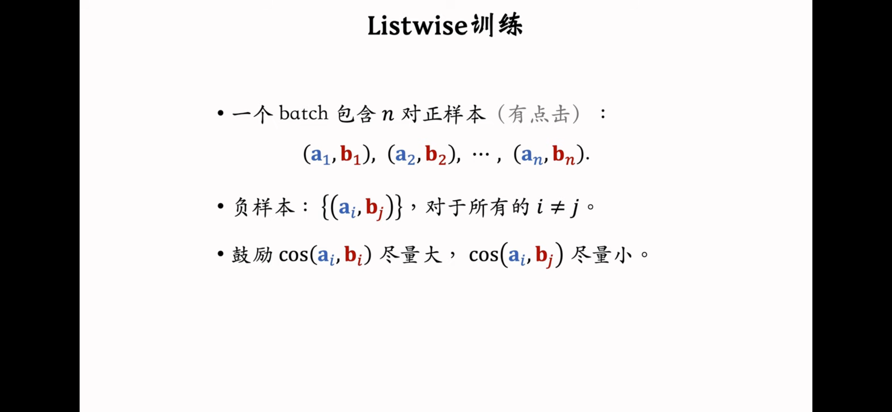
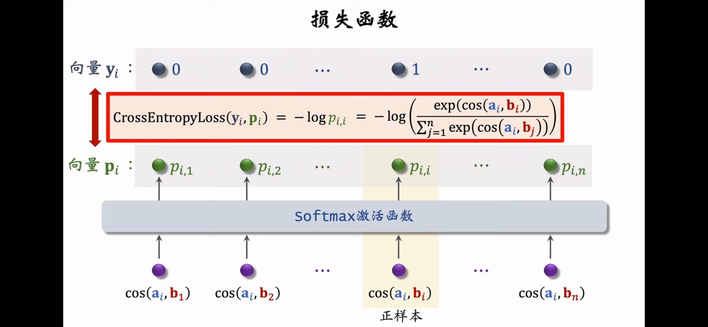

Listwise training can be viewed as [Batch Negative Items](#2-batch-negative-items), which can disproportionately penalize popular items, negatively affecting overall performance. To address this, it's essential to adjust the equation accordingly:

#### Applying Self-Supervised Learning in Item Tower:
For each item, we can create different `item_vectors` by extracting various features or applying random masking. The goal is to reward or penalize based on specific scenarios.

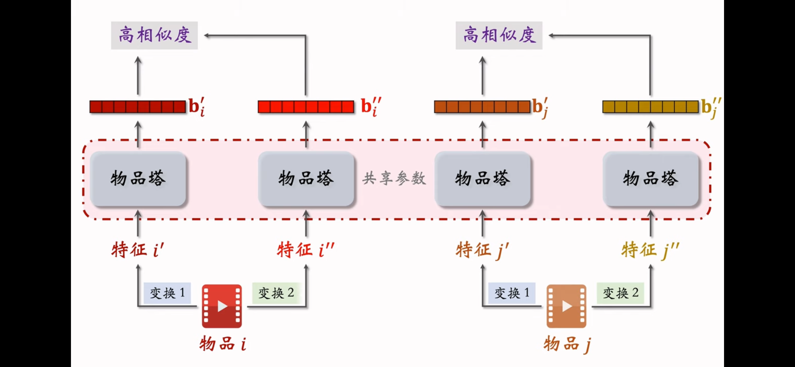

The diagram above shows that we should reward similar `item_vectors` derived from the same item, while also rewarding dissimilar `item_vectors` generated from different items.

#### Feature Transformation
- **Random Mask:** Randomly mask some discrete features of an item (e.g., `{digital, photograph}` becomes `{default}`).
- **Dropout:** Applicable only to multi-valued features; randomly masks **50%** of the features (e.g., `{cosmetic, photograph}` becomes `{cosmetic}`).
- **Complementary:** Masks specific features and generates a new `item_vector` accordingly.
  
- **Cover Related Feature Sets:** Masks some related feature sets:
  - Sexual Features: $U = \lbrace male, female, other \rbrace$
  - Categories: $V = \lbrace cosmetic, digital, football, tech, ... \rbrace$

  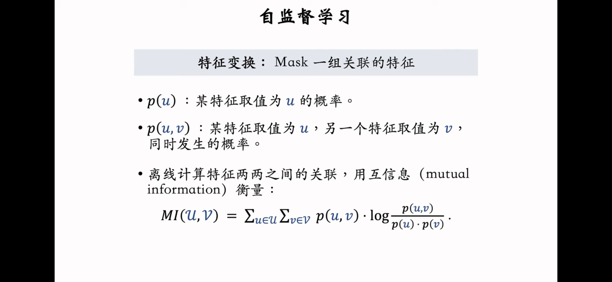

  When there are $k$ feature sets, calculate the **Mutual Information (MI)** between each set to get a $k \times k$ MI matrix. Randomly select a base feature set (e.g., Category) and identify the top $k/2$ most related feature sets. Finally, mask both the base feature set and these $k/2$ related feature sets.

  - **Advantages:** Yields the best performance among all methods.
  - **Disadvantages:** Complicated to compute and challenging to maintain. (Do we need to consider maintainability?)

#### Training the Item Tower
1. Randomly sample $m$ items (with equal probability, independent of `user-item` pairs) to form a batch.
2. Perform Feature Transformation to generate 2 `item_vectors`.
3. Compute the loss function.

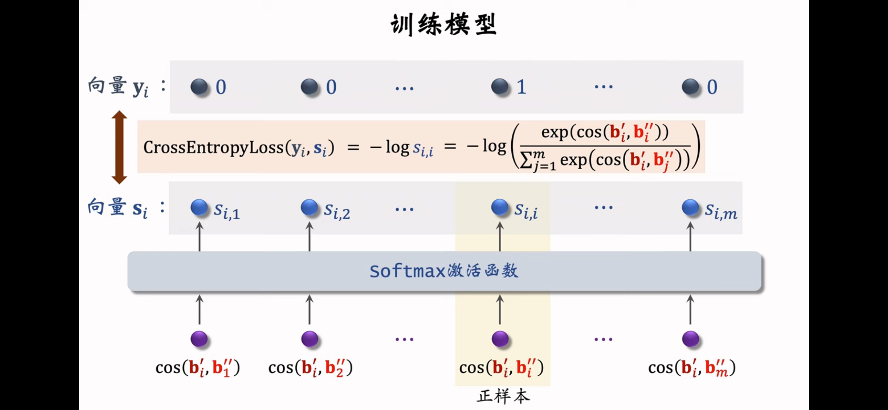

For each item, there is one positive sample (same item but different `item_vectors` due to Feature Transformation, with a probability $s_{(i,i)} \approx 1$) and $m-1$ negative samples. The aim is for the `s_vector` (training result) to be close to the `y_vector` (target vector). We take the average loss for the $m$ items and use **Gradient Descent** to solve the minimization problem.

#### Combining with the DSSM Model
1. Randomly sample $n$ `user-item` pairs to form a batch.
2. Randomly sample $m$ items (with equal probability) to form a batch.
3. Apply **Gradient Descent** to minimize the combined loss function (the second part is from Self-Supervised Learning):

$$
{1 \over n} \sum^n_{i=1} L_{main}[i] + \alpha \times {1 \over m} \sum^m_{j=1} L_{self}[j]
$$

## Deep Retrieval (DR)
Unlike DSSM, which vectorizes users and items to find the **Nearest Neighbor (NN)**, Deep Retrieval identifies the most relevant paths for a user and retrieves all items within those paths. It functions similarly to [Tree-based Deep Models (TDM)](https://arxiv.org/pdf/1801.02294) from Alibaba Group.

### Indexing
#### Path-to-Item Index Table
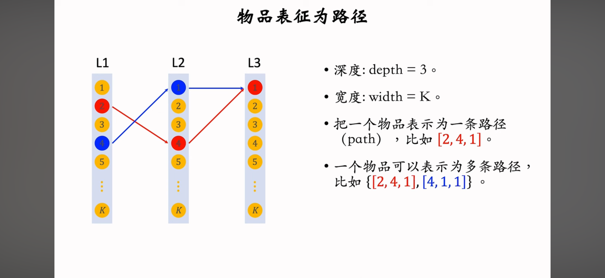

A single path can represent a list of items (Path -> List\<Item>), and this index table is used during retrieval.  
Example: `depth = 3`, `width = K`, `item 1: {[2, 4, 1], [4, 1, 1]}`.

#### Item-to-Path Index Table
An item can belong to multiple paths (Item -> List\<Path>), and this index table is used during neural network training.

### Predictive Model
A neural network model predicts user interest across different paths.

#### Predicting User Interest
For a model with `depth = 3`, there are three layers $[a, b, c]$ in each path:

1. Given user feature $x$, predict interest at point $a$, $p_1(a|x)$.
2. Given $x$ and point $a$, predict interest at point $b$, $p_2(b|a; x)$.
3. Continue to the last layer, $p_3(c|a, b; x)$.
4. Combine probabilities to predict interest in the path $[a, b, c]$:  
   $$p(a, b, c|x) = p_1(a|x) \times p_2(b|a; x) \times p_3(c|a, b; x)$$

#### Neural Network Practice
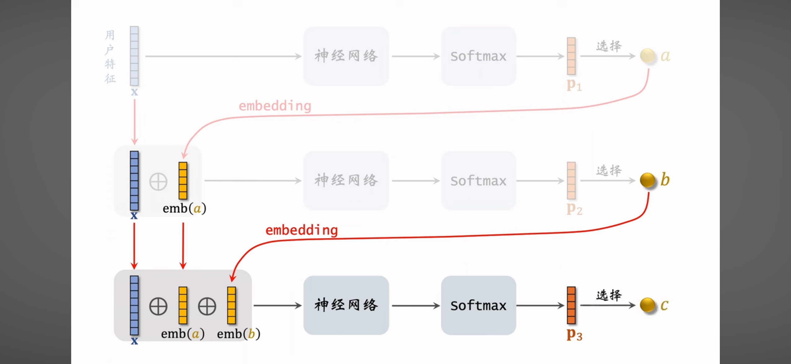

### Retrieval Procedure
1. Given user features, use **beam search** (a greedy algorithm) to retrieve some paths.
2. Use the Path-to-Item Index Table to fetch items for the selected paths.
3. Rank the items and select a subset to return to the user.

#### Beam Search
For `depth = 3` and `width = K`, there are $K^3$ paths. Calculating all paths is infeasible, so we use a beam size `n` to select the top `n` paths at each step.

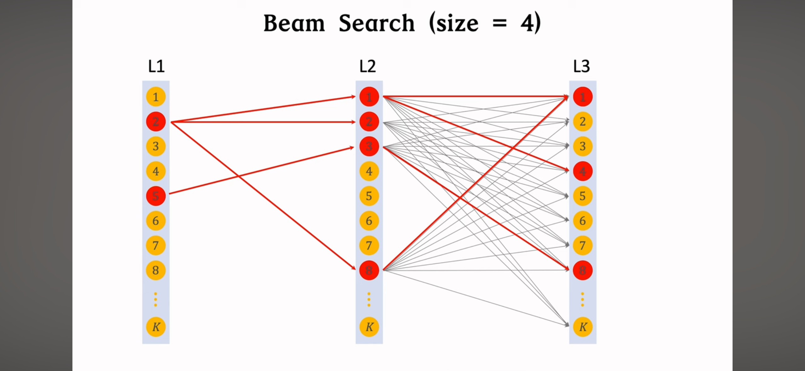

In each layer, retain the `top-n` paths based on user interest. For example, with `n = 4`, select 4 points in the first layer, calculate interest for the next point across $4 \times K$ paths, and retain the `top-4` paths. Repeat until the last layer.

Total Computation: $n + (n \times K) \times (depth - 1)$.

*Note: when n = 1, Beam Search is equivalent to the Greedy Algorithm.*

### Training
Both (1) `neural network parameters` and (2) `item features (paths)` can be trained simultaneously to improve the Deep Retrieval (DR) model.

- **User Interest to Path**: $p(path|x)$  
  Train the neural network parameters using (1) the item-to-path index and (2) user interactions.
  
- **Item and Path Relationship**: `Item <- User -> Path`  
  Create mappings between items and paths (Item -> List<Path> of length $J$). Balance the number of items per path.

#### Training the Neural Network
1. Represent item features as $J$ paths: $[a_1, b_1, c_1], [a_2, b_2, c_2], ..., [a_J, b_J, c_J]$.
2. User interest for path $[a, b, c]$:  
   $$p(a, b, c|x) = p(a|x) \times p(b|a; x) \times p(c|a, b; x)$$
3. If a user interacts with an item, it implies interest in the item’s $J$ paths.
4. Maximize user interest in these paths:  
   $$\max \sum^J_{j=1} p(a_j, b_j, c_j|x)$$
5. **Loss Function**:  
   $$
   \text{loss} = -\log \sum^J_{j=1} p(a_j, b_j, c_j|x)
   $$
   *Assumes user interaction indicates interest in the item, increasing predicted probability for $J$ paths.*

#### Training Item Features
1. User interest in a path $[a, b, c]$:  
   $$p(a, b, c|\text{user}) = p(a, b, c|x)$$
2. Item-path relationship:  
   $$
   \text{score(item, path)} = \sum_{\text{user}} p(\text{path}|\text{user}) \times \text{click(user, item)}
   $$  
   where $p(\text{path}|\text{user})$ represents user interest in the path, and $\text{click(user, item)}$ is user interaction with the item (values {0, 1}).
3. Calculate $score(item, path)$ and select $J$ paths as item features, $\Pi = \lbrace \text{path}_1, ..., \text{path}_J \rbrace$.
4. Maximize item feature quality:  
   $$\max \sum^J_{j=1} \text{score(item, path}_j)$$
5. **Loss Function**:
   $$
   \text{loss} = -\log \sum^J_{j=1} \text{score(item, path}_j)
   $$
6. **Regularization** (to avoid excess items per path):  
   $$
   \text{reg(path}_j) = (\text{number of items on path}_j)^4
   $$
7. **Greedy Algorithm**:  
   For each update, fix ${\lbrace \text{path}_i \rbrace}_{i\neq l}$, and from unselected paths, choose the path $\text{path}_l$:
   $$
   \text{path}_l = \arg \min_{\text{path}_l} \text{loss(item, } \Pi\text{) + } \lambda \times \text{reg(path}_l\text{)}
   $$
   *This ensures $\text{path}_l$ has a high $score(item, path)$ while balancing item distribution.*

## Bloom Filter
The Bloom Filter plays a crucial role in content recommendation. When a user has read specific content, that content should be excluded from future feature retrieval results. Additionally, content that has been exposed but not interacted with should also be taken into account. However, directly comparing all items is computationally expensive. If a user has read $n$ items and there are $r$ retrieved items, the complexity would be $O(n \times r)$.

*Note: Some content recommendation systems, such as YouTube, may still occasionally suggest previously seen content to a user.*

### Steps
A Bloom Filter can efficiently determine if an `item_id` is part of an exposed item collection:
- If the result is `False`, the item is not in the collection.
- If the result is `True`, the item may be in the collection (with a small chance of error).

#### How It Works:
1. The filter treats the item features collection as an **m-dimensional binary vector**.
2. Each user has a vector that records the history of exposed items.
3. The Bloom Filter uses $k$ hash functions. Each function maps `item_id` to a fixed range from $0$ to $m-1$.

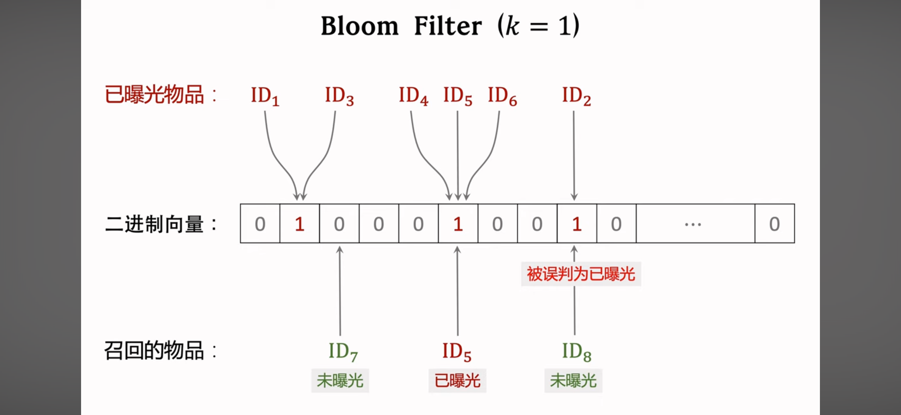

### Adjusting the Value of $k$
Increasing $k$ (the number of hash functions) assigns more bits in the binary vector per `item_id`. For example, if `k=3`, each item will set three bits in the vector to 1. This helps reduce the **error rate** since an item is confirmed as "possibly in the collection" only if all bits set by the $k$ hash functions are 1.

**Error Rate** (collection size = $n$):
$$
\delta \approx (1 - e^{-kn/m})^k
$$

Optimal values for $k$ and $m$:
- **Optimal $k$**: 
  $$ k^* = 1.44 \times \ln \left(\frac{1}{\delta}\right) $$
- **Optimal $m$**:
  $$ m^* = 2n \times \ln\left(\frac{1}{\delta}\right) $$

### Disadvantages of Using a Bloom Filter
**One-Way Operation**: Bloom Filters only support adding items to the collection by setting bits according to the $k$ hash functions. Removing an item does not reset the bits, meaning it can only expand the collection, not shrink it.

*If a time constraint applies to items (e.g., a 1-month validity period), expired items can be removed to reduce the error rate. This, however, requires recalculating the vectors to ensure accuracy.*
